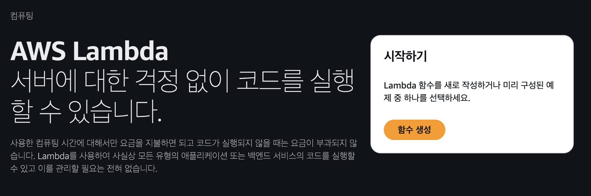
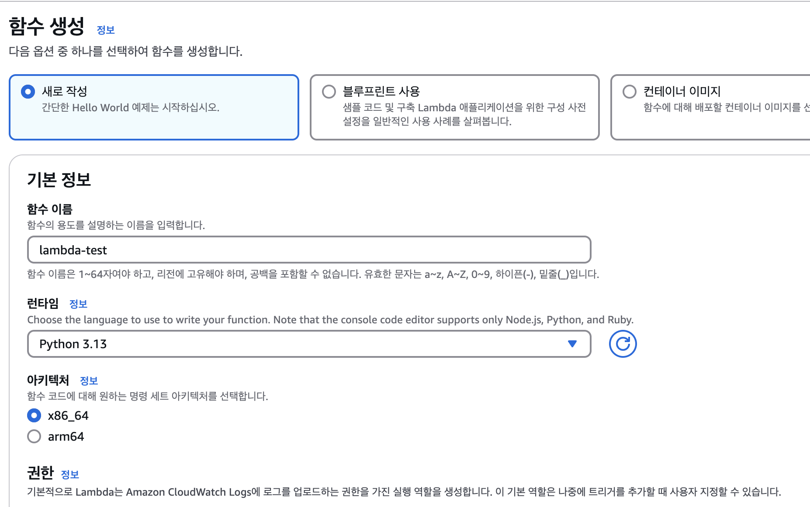
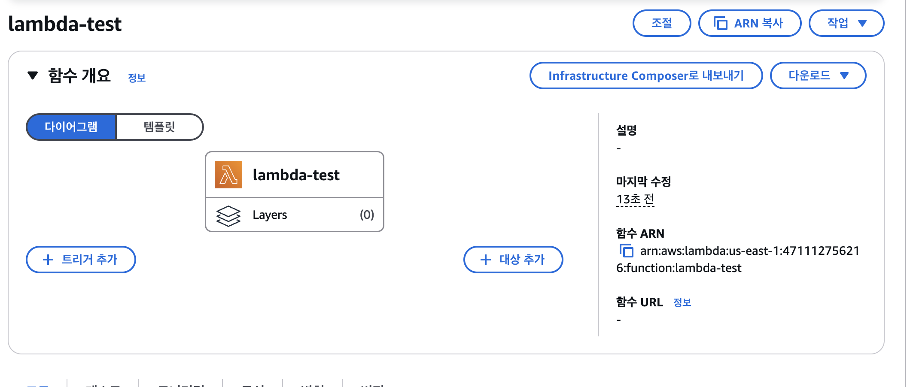
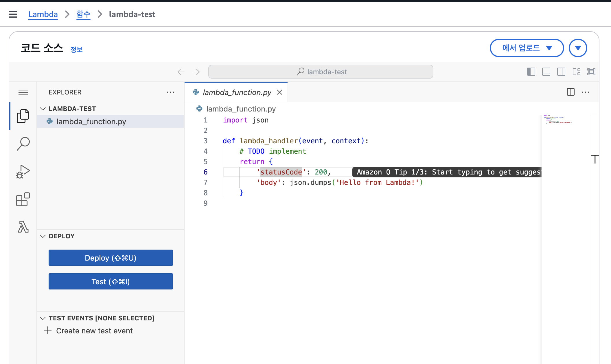
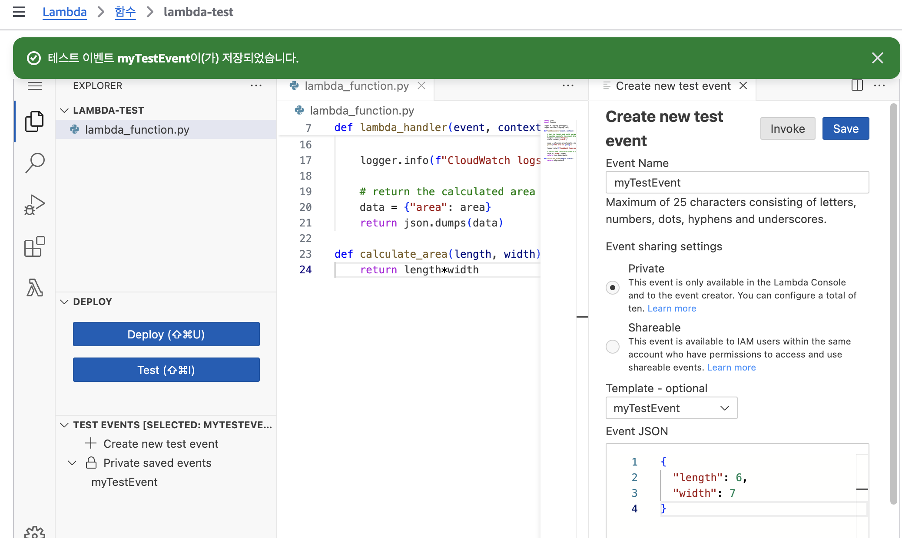
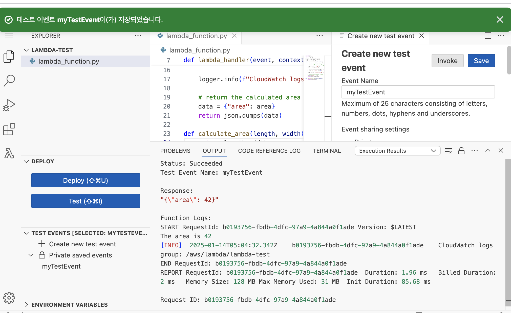
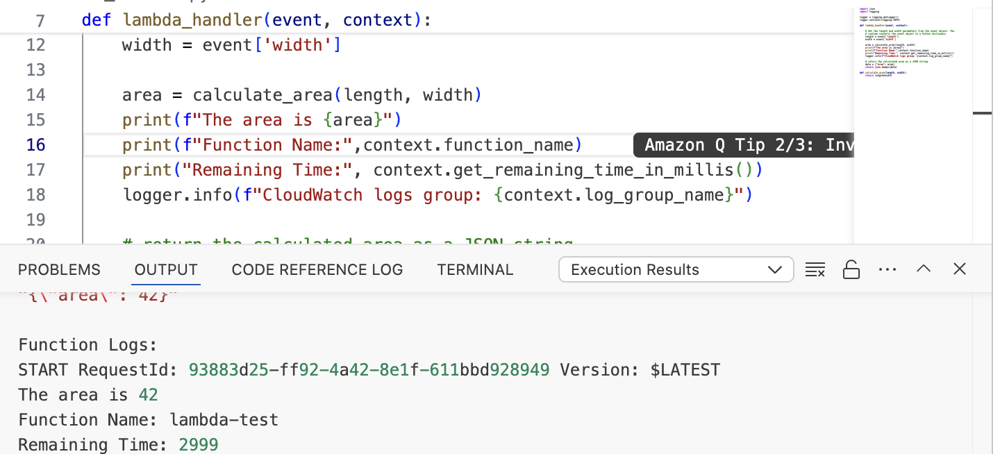

Lambda는 다양한 언어를 지원하지만 `Python` 이나 `Node.js` 같은 스크립트 언어로 개발하는 것이 편하다.

*이 튜토리얼은 Python을 사용하여 예시가 작성 되었습니다.(나머지 예제는 [공식 문서](https://docs.aws.amazon.com/ko_kr/lambda/latest/dg/welcome.html) 참조*

## 기본 개념

- **함수**: 실행 단위.
- **이벤트 소스**: 함수를 트리거하는 이벤트.
- **런타임**: 코드 실행 환경.
- **레이어**: 코드와 라이브러리 분리.

### Lambda 생성

먼저 AWS 계정을 [등록](https://signin.aws.amazon.com/signup?request_type=register)하고, 관리자 액세스 권한이 있는 [사용자를 생성](https://docs.aws.amazon.com/ko_kr/singlesignon/latest/userguide/what-is.html)한다.

그 다음은 AWS 콘솔로 함수를 생성한다.

1. Lambda 콘솔의 [함수 페이지](https://console.aws.amazon.com/lambda/home#/functions)를 연다.



2. **함수 생성(Create function)**을 선택.



3. **새로 작성**을 선택.

4. **기본 정보** 창의 **함수 이름**에 `lambda-test` 을 입력.

5. **런타임**에서 **Node.js 22.x** 또는 **Python 3.13**을 선택.

6. **아키텍처**를 **x86_64**로 설정된 상태로 두고 **함수 생성**을 선택.




Console에서 제공하는 기본 코드 편집기를 사용해 코드를 편집한다.

```python
import json
import logging

logger = logging.getLogger()
logger.setLevel(logging.INFO)

def lambda_handler(event, context):
    
    # Get the length and width parameters from the event object. The 
    # runtime converts the event object to a Python dictionary
    length = event['length']
    width = event['width']
    
    area = calculate_area(length, width)
    print(f"The area is {area}")
        
    logger.info(f"CloudWatch logs group: {context.log_group_name}")
    
    # return the calculated area as a JSON string
    data = {"area": area}
    return json.dumps(data)
    
def calculate_area(length, width):
    return length*width
```

- `lambda_handler` : Lambda 함수의 Entry Point, 이름은 임의로 지정할 수 있으니 일반적으로 이 이름 사용, JSON을 반환한다.
- `event` : Lambda 함수에 전달되는 입력 데이터, 이벤트 소스(S3, API Gateway, DynamoDB,...)에서 발생한 데이터를 포함. JSON 형태로 전달되며, 이벤트 소스에 따라 구조가 다르다.

```json
// Event Example

{ // apigateway
  "httpMethod": "GET",
  "path": "/hello",
  "queryStringParameters": {
    "name": "John"
  }
  
  // S3
  { 
  "Records": [
    {
      "s3": {
        "bucket": {
          "name": "my-bucket"
        },
        "object": {
          "key": "my-file.txt"
        }
      }
    }
  ]
}
}
```

- `context` : 함수의 실행 환경 정보를 제공, 함수의 실행 시간, 메모리 제한, 요청 ID 등 런타임을 포함.
	- `function_name`: 현재 실행 중인 Lambda 함수의 이름. 
	- `memory_limit_in_mb`: 함수에 할당된 메모리 크기(MB).
	- `remaining_time_in_millis`: 함수 실행이 종료되기까지 남은 시간(ms).
	- `aws_request_id`: 현재 요청의 고유 ID.


모두 완료되었으면 배포 섹션에서 배포를 눌러 Lambda 함수를 배포한다.



테스트 이벤트로 배포한 함수를 테스트 한다.



