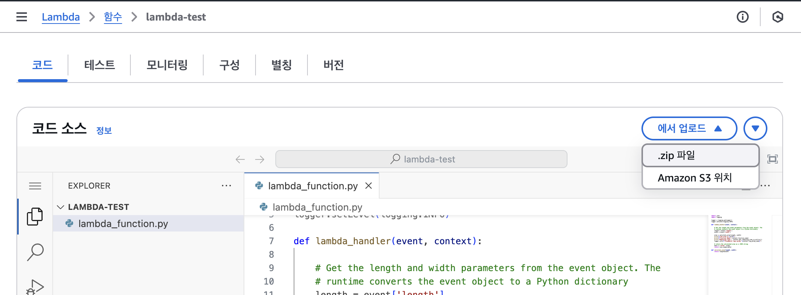

AWS Lambda 함수의 코드는 함수의 핸들러 코드가 포함된 .py 파일과 코드가 의존하는 추가 패키지 모듈로 구성된다.

Lambda에 이 함수 코드를 배포하려면 `Deploy Package` 를 사용한다.

이 패키지는 `.zip` 파일 아카이브 또는 [컨테이너 이미지](https://docs.aws.amazon.com/ko_kr/lambda/latest/dg/python-image.html) 일 수 있다.

배포 패키지를 `.zip` 파일 아카이브로 생성하려면 명령줄 도구의 기본 제공 `.zip` 파일 아카이브 유틸리티 또는 `7zip` 과 같은 기타 `.zip` 파일 유틸리티를 사용한다.


## 배포 패키지 생성 - 프로젝트 디렉터리

프로젝트 디렉터리를 먼저 만든다. 그리고 그 디렉터리로 들어가서 종속 항목을 설치할 `package` 라는 새 디렉터리를 생성한다.

```shell
cd <project-dir>
mkdir package
```

> `.zip` 배포 패키지의 경우 `Lambda` 는 소스 코드와 해당 종속 항목이 모두 `.zip`  파일 Root에 있을 것으로 예상한다. 
> 그러나 프로젝트 디렉터리에 종속 항목을 직접 설치하면 많은 수의 새 파일과 폴더가 생겨서 IDE 탐색이 어려워 질 수 있게 때문에 `package` 디렉터리를 생성하여 종속 항목을 소스 코드와 별도로 유지한다.

다음 예제와 같이 `package` 디렉터리에 종속성을 설치한다.

```Shell
pip install --target ./package boto3
```

모든 종속성 설치가 끝나면 Root에 `.zip` 파일을 생성한다.

```shell
cd package
zip -r ../<project-name>_package.zip
```

이제 프로젝트 루트에 핸들러 함수가 들어간 파일을 생성하여 작성하고 package `.zip` 파일과 소스 코드 파일을 압축하여 `.zip` 파일을 만든다. 

```Shell
cd ..
zip <project-name>_package.zip lambda_function.py
```

최종적인 구조는 다음과 같다.

```Tree
<project-name>_package.zip 
|- bin 
| |-jp.py 
|- boto3 
| |-compat.py 
| |-data 
| |-docs 
... 
|- lambda_function.py
```

*🔥 함수에 핸들러 코드를 포함하는 .py 파일이 .zip 파일의 루트에 없는 경우 Lambda는 코드를 실행할 수 없다.*


## 배포 패키지 생성 - 가상환경

프로젝트 디렉터리에 가상 환경을 생성하고 활성화 한다. 
(이 예제에서 프로젝트 디렉터리는 `my_function` )

```Shell
cd my_function
python3.13 -m venv <my_virtual_env>
source ./<my_virtual_env>/bin/activate
```

가상환경이 활성화 된 상태에서 `pip` 를 사용하여 필요한 라이브러리를 설치한다.

```Shell
pip install <PyPI packages>
```

`pip show` 를 통해 가상환경에서 pip가 종속 항목을 설치한 위치를 찾는다.

```Shell
pip show <package_name>
```

*pip 가 라이브러리를 설치한 폴더 이름은 `site-packages` 또는 `dist-packages` 일 수 있다.*
*이 폴더는 `lib/python3.x` 또는 `lib64/python3.x` 디렉터리에 있을 수 있다.*

가상환경을 비활성화

```shell
deactivate
```

설치한 종속 항목이 포함된 디렉터리로 이동하여 Root에 디렉터리를 압축한 `.zip` 을 생성한다.

```Shell
cd <my_virtual_env>/lib/python3.13/site-packages
zip -r ../../../../my_deployment_package.zip .
```

핸들러 코드가 포함된 .py 파일이 있는 프로젝트 디렉터리의 루트로 이동하여 해당 파일을 `.zip` 패키지의 루트에 추가한다.

```Shell
cd cd ../../../../
zip my_deployment_package.zip lambda_function.py
```


## 주의사항

### `__pycache__` 폴더 사용

함수 배포 패키지에 `__pycache__` 폴더를 사용하지 않는 것이 좋다.
다른 아키텍처나 운영 체제의 빌드 시스템에서 컴파일된 Python 바이트 코드는 Lambda 실행 환경과 호환되지 않을 수 있다.

### 네이티브 라이브러리를 .zip 배포 패키지 생성

함수가 Python 패키지 및 모듈만 사용하는 것이 아닌 경우(Numpy, Pandas, ...)는 C, C++ 같은 다른 언어의 소스 코드를 포함한다.

이때 이런 패키지들이 Lambda 실행 환경과 호환되도록 패키지를 올바르게 빌드 해야한다.

대부분의 [PyPI](https://pypi.org/) 에서 사용할 수 있는 대부분의 패키지는 `휠(.whl)` 로 사용할 수 있다.
	*`.whl` 파일은 특정 운영 체제와 명령 세트 아키텍처용으로 미리 컴파일된 바이너리가 포함된 빌드된 배포판을 포함하는 일종의 ZIP 파일이다.*

배포 패키지가 Lambda와 호환되도록 하려면 Linux 운영 체제용 휠과 함수의 명령 세트 아키텍처를 설치해야 한다. *(일부 패키지는 소스 배포판으로 사용할 수 있고 C/C++ 구성 요소를 직접 컴파일하고 빌드 해야 한다.)*

1. [Python Package Index](https://pypi.org/) 에서 패키지 이름을 검색
2. 사용할 패키지의 버전을 선택
3. Download files를 선택
4. .whl 파일을 디렉토리로 옮기고 unzip
5. 다음을 수행

```shell
rm -r *.whl *.dist-info __pycache__
zip -r package.zip .
```



6. 이제 이 `.zip` 파일을 Lambda에서 함수 패키지 업로드 


## 빌드된 배포판 작업

Lambda와 호환되는 `휠(.whl)` 을 다운로드 하려면 `pip --platform` 옵션을 사용한다.

**x86_64**

```Shell
pip install \
--platform manylinux2014_x86_64 \
--target=package \
--implementation cp \
--python-version 3.x \
--only-binary=:all: --upgrade \
<package_name>
```

**arm64**

```Shell
pip install \
--platform manylinux2014_aarch64 \
--target=package \
--implementation cp \
--python-version 3.x \
--only-binary=:all: --upgrade \
<package_name>
```


## .zip 파일을 사용하여 Python Lambda 함수 생성 및 업데이트

>*Lambda용 `.zip` 배포 패키지의 최대 크기는 250MB(압축 해제시)이다.* 
>
> *이 제한은 Lambda 계층을 포함하여 업로드하는 모든 파일의 합산 크기에 적용된다.*

Lambda의 런타임은 배포 패키지를 읽을 수 있는 권한이 필요하다. 

- 실행 불가능한 파일 : `644(rw-r--r--)` 권한
- 디렉터리 및 실행 파일 :  `755(rwxr-xr-x)` 권한

```shell
chmod 644 <filepath>
chmod 755 <dirpath or filepath>
```

따로 디렉토리에 권한을 부여하지 않을 시 Lambda는 `755(rwxr-xr-x)` 권한을 부여한다.

`.zip` 배포 패키지를 업로드하고 권한 설정이 끝나면 [함수](https://console.aws.amazon.com/lambda/home#/functions) 페이지에서 **소스 코드** 파일을 선택하여 **배포**를 진행한다.

추가적인 내용은 [문서](https://docs.aws.amazon.com/ko_kr/lambda/latest/dg/python-package.html)를 참고