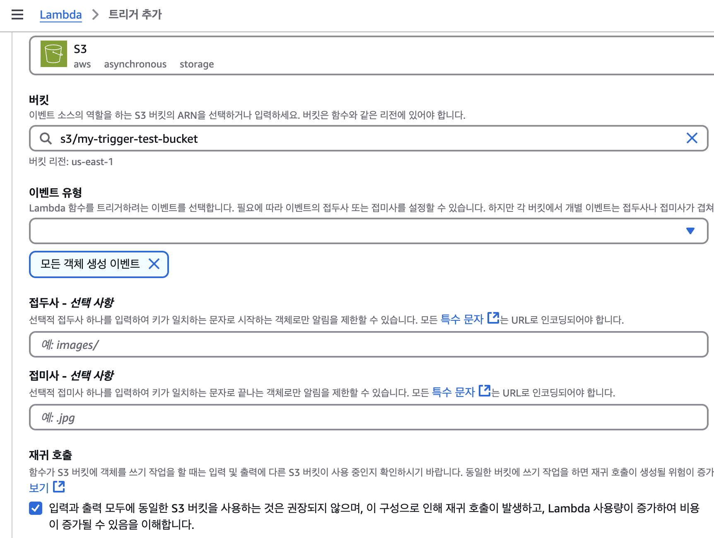

Lambda는 AWS의 다양한 트리거를 통해 간접적으로 호출할 수 있다.

> Example: S3 버킷에 객체가 추가될 때마다 호출, APIGateway에 Request가 왔을 때마다 호출

다음 두가지 예시를 통해 트리거 호출에 대해 알아보겠다.

## S3 트리거를 사용하여 간접 호출

먼저 S3의 버킷을 하나 생성한다.


> ⭐️ 버킷과 Lambda는 동일한 리전에 생성해야 한다.

파일을 S3에 업로드해 정상적으로 업로드 되는지 확인한다.

_640x640 테스트 이미지_


업로드 확인이 끝났으면 Lambda가 S3에서 객체를 가져오고 Cloud watch로 확인할 수 있도록 권한 정책을 생성한다.

**정책 생성**

1. IAM 콘솔에서 [정책 페이지](https://console.aws.amazon.com/iam/home#/policies) 를 연다.
2. **정책 생성(Create Policy)** 를 선택
3. **JSON** 탭에서 다음과 같은 사용자 지정 정책을 JSON 편집기에 넣는다.

```JSON
{
    "Version": "2012-10-17",
    "Statement": [
        {
            "Effect": "Allow",
            "Action": [
                "logs:PutLogEvents",
                "logs:CreateLogGroup",
                "logs:CreateLogStream"
            ],
            "Resource": "arn:aws:logs:<Region>:<account-id>:log-group:<log-group-name>:*"
        },
        {
            "Effect": "Allow",
            "Action": [
                "s3:GetObject"
            ],
            "Resource": "arn:aws:s3:::<bucket-name>/*"
        }
    ]
}
```


4. **정책 검토** 의 **이름** 에 `s3-trigger-tutorial` 을 입력한다.
5. `태그` 에 적절한 태그를 입력
6. **정책 생성** 을 선택


정책을 생성 했다면 IAM 콘솔에서 [역할 페이지](https://console.aws.amazon.com/iam/home#/roles) 를 열어 역할을 생성한다.


- 신뢰할 수 있는 엔터티 유형 **AWS 서비스** 선택, 사용 사례 **Lambda** 선택 후 다음


- 정책 검색 상자에서 `s3-trigger-tutorial` 을 입력하여 정책을 찾아 선택 후 다음


- **Role detail(역할 세부 정보)** 에서 **Role name(역할 이름)** `lambda-s3-trigger-role` 을 입력하고 **Create role(역할 생성)** 을 선택한다.

이제 Lambda 함수를 만든다.


- **함수명** : `s3-trigger-test`

- **Python** : 3.12

- **Architecture** : x86_64

- **기본 실행 역할 변경** > **기존 역할 사용** > `lambda-s3-trigger-role` 선택 후 함수 생성

- [소스 코드](https://docs.aws.amazon.com/ko_kr/lambda/latest/dg/with-s3-example.html#with-s3-example-upload-test-object) 작성

```python
# Copyright Amazon.com, Inc. or its affiliates. All Rights Reserved.
# SPDX-License-Identifier: Apache-2.0
import json
import urllib.parse
import boto3

print('Loading function')

s3 = boto3.client('s3')


def lambda_handler(event, context):
    #print("Received event: " + json.dumps(event, indent=2))

    # Get the object from the event and show its content type
    bucket = event['Records'][0]['s3']['bucket']['name']
    key = urllib.parse.unquote_plus(event['Records'][0]['s3']['object']['key'], encoding='utf-8')
    try:
        response = s3.get_object(Bucket=bucket, Key=key)
        print("CONTENT TYPE: " + response['ContentType'])
        return response['ContentType']
    except Exception as e:
        print(e)
        print('Error getting object {} from bucket {}. Make sure they exist and your bucket is in the same region as this function.'.format(key, bucket))
        raise e
```

소스 코드 작성 후 배포



Lambda를 다 만들었으면 이제 S3 트리거를 만든다.

- **S3** 선택

- **버킷** : 이전에 생성한 버킷 이름

- **이벤트 유형** : 모든 객체 생성 이벤트

- **재귀 호출** : 체크(내용 잘 읽어 보기)

트리거를 추가한다.


### 버킷 트리거 테스트

- 버킷에 이미지를 업로드(아까 업로드 했던 이미지를 삭제하고 다시 업로드)

- [CloudWatch](https://console.aws.amazon.com/cloudwatch/home) 콘솔에서 함수 간접 호출 확인

- Lambda 함수가 생성된 리전으로 이동 후 로그 > 로그 그룹 > (아까 생성한 그룹 이름) > 로그 스트림 > 가장 최근 로그 스트림


